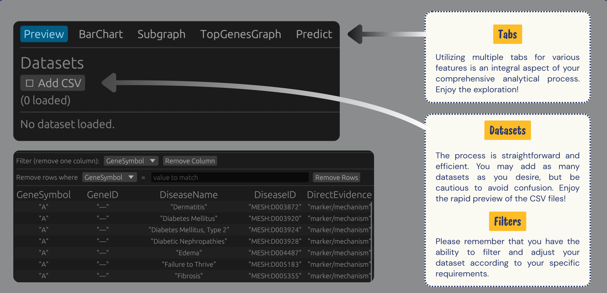

# GeneNet

> A biomedical relationship explorer built by two students in just a few days for a college project!

## 📖 About
GeneNet is a desktop application that lets users explore relationships between genes, diseases, and drugs by visualizing them as interactive graphs. We built this app as a college project in just a few days, and it was an amazing learning experience for us!

The app not only visualizes known relationships but also uses a graph neural network (GNN) model to predict potential new or missing interactions — connections that might not yet be discovered or recorded in current databases.

## ✨ Features
- **Dataset Upload**: Load CSVs of biomedical relationships
- **Smart Filtering**: Filter out columns or labels that you don't consider relevant for the dataset
- **Bar Charting**: Generate grouped count charts for more insight
- **Graph Visualization**: Interactive color-coded network viewer to construct a graph of relationships between genes and diseases
- **GNN Predictions**: Discover potential new links and suggest related diseases/genes not explicitly linked in the dataset
- **Advanced Querying**: Retrieve connected diseases or genes, subgraphs, and communities

*Note: Some features are still being worked on as this was a short-term project*

## 🛠️ Technologies
We kept it simple due to our tight timeline:
- **Frontend**: Rust
- **Backend**: Python
- **Communication**: Process pipes between Rust and Python

## 📸 Screenshots

### Project Structure

*Project organization with notes and datasets*

### Feature Tabs

*Each tab represents a different feature of the application*

### Bar Charts

*Generate insightful bar charts (and capture Python output)*

### Subgraph Visualization

*Explore specific subgraphs of interest*

### Large Graph Visualization

*Visualize complex networks with many nodes and connections*

## 🚀 Getting Started
To get started with GeneNet, follow these steps:

1. **Set up Python Environment**:
   - Create a Python virtual environment in the project root:
     ```bash
     python -m venv venv
     ```
   - Activate the virtual environment:
     - On Windows: `venv\Scripts\activate`
     - On macOS/Linux: `source venv/bin/activate`

2. **Install Required Packages**:
   - Install all necessary Python packages:
     ```bash
     pip install -r requirements.txt
     ```
   - If requirements.txt is not available, you may need to install packages manually based on import statements in the Python code.

3. **Build and Run**:
   - Follow the Rust build instructions to compile and run the frontend.

Feel free to test GeneNet for yourself and even make it better! This application was made purely as a learning experience, and we'd love to see it grow.

## 👋 Thanks for checking out our project!
We had a blast building this in our short timeframe and learned a ton about both bioinformatics and software development. We hope you enjoy exploring it as much as we enjoyed creating it!
